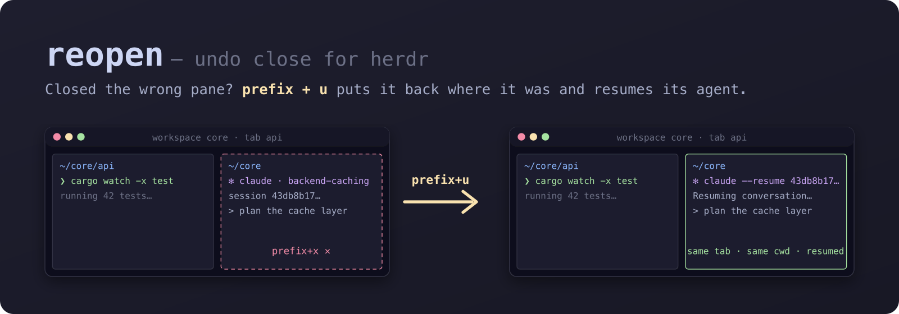

<p align="center">
  
</p>

<p align="center">
  <a href="https://github.com/rchougule/herdr-pane-reopen/actions/workflows/ci.yml"></a>
  
  
  <a href="LICENSE"></a>
</p>

# reopen

Undo close for [herdr](https://herdr.dev). Press `prefix+u` and the pane, tab or workspace
you just closed comes back where it was: same workspace, same tab, same position, same
working directory, same split layout. If the pane was running a coding agent, its
conversation is resumed.

```
          you close …                    reopen restores …
  ┌──────────────┬───────┐        ┌──────────────┬───────┐
  │              │  p2 ✗ │        │              │  p2'  │   pane:  split back beside its
  │      p1      ├───────┤   →    │      p1      ├───────┤          old sibling, same side,
  │              │  p3   │        │              │  p3   │          same ratio
  └──────────────┴───────┘        └──────────────┴───────┘

  tab ✗        (3 panes, nested splits)  →  the tab, every pane, exact ratios and labels
  workspace ✗  (2 tabs, 3 panes)         →  the workspace, every tab, original tab order
```

A close in herdr cascades: closing the last pane closes its tab, closing the last tab
closes its workspace. reopen restores exactly what you lost, as one undo, and never drops a
pane into some other tab.

## The honest limit

A closed pane's process is gone. reopen brings back the working directory, the layout,
the labels, the placement, and the agent conversation. It cannot bring back a running dev
server, a test run, an editor, an unsaved REPL, or scrollback.

For a plain shell pane, reopen remembers the command that was in the foreground and
prefills it at the new prompt without pressing Enter. You decide whether running it again
is safe. Opt-in `run` mode is available for commands you trust.

## Install

```sh
herdr plugin install rchougule/herdr-pane-reopen
```

Requires herdr 0.9.1 or newer and a Rust toolchain on the installing machine, because the
install step runs `cargo build --release`.

Then add the keybinding to `~/.config/herdr/config.toml` and reload. `prefix+u` does not
collide with any default herdr binding.

```toml
[[keys.command]]
key = "prefix+u"                       # ctrl+b, then u
type = "plugin_action"
command = "rchougule.reopen.reopen-last"
description = "Reopen last closed pane/tab/workspace"
```

```sh
herdr server reload-config
herdr plugin action invoke rchougule.reopen.doctor   # arms the snapshot daemon right away
```

The plugin arms itself on the next herdr event or server start; running `doctor` once after
installing does it immediately and confirms the keybinding is in place.

## Usage

| What | How |
| --- | --- |
| Undo the last close | `prefix+u` |
| Same, from the CLI | `herdr plugin action invoke rchougule.reopen.reopen-last` |
| Show the undo stack | `herdr plugin action invoke rchougule.reopen.list` |
| Restore a specific entry | `target/release/reopen reopen --id <n>` from the plugin directory; ids come from `list` |
| Check health and keybinding | `herdr plugin action invoke rchougule.reopen.doctor` |

The stack keeps the last 20 closes for 24 hours. Restoring an entry removes it from the
stack; a restored pane that is closed again is captured normally.

## Agent resume

When the closed pane hosted a coding agent and herdr had recorded its session id, reopen
recreates the pane and starts the agent with that kind's resume arguments.

| Agent | Resume arguments | Status |
| --- | --- | --- |
| `claude` | `--resume <id>` | verified end to end |
| `codex` | `resume <id>` | verified against `--help` |
| `cursor` | `--resume <id>` | verified against `--help` |
| `hermes` | `--resume <id>` | verified against `--help` |
| `opencode` | `--session <id>` | verified against `--help` |
| `grok`, `devin`, `droid`, `qodercli`, `qwen` | `--resume <id>` | from documentation |
| `omp`, `copilot` | `--resume=<id>` | from documentation |

Any row can be overridden in the plugin config without waiting for a release:

```toml
[resume.grok]
args = ["--session-id", "{id}"]        # {id} is substituted verbatim
```

herdr only reports a session id when the agent's integration is installed
(`herdr integration status`). If a resume fails, reopen falls back to prefilling the
command at the prompt. An agent session with no turns has no transcript yet, so resuming
it lands on a fresh prompt; that is the agent CLI's behaviour.

## Configuration

Optional. Create `config.toml` in the directory printed by
`herdr plugin config-dir rchougule.reopen`:

```toml
focus_on_reopen     = true    # focus what was just restored
notify_on_close     = false   # toast on every capture
notify_on_reopen    = true    # toast after a restore
capture_exited      = true    # also offer panes whose shell exited on its own
entry_ttl_hours     = 24      # drop older entries; herdr recycles container ids
process_info_ttl_ms = 5000    # how often a shell pane's foreground command is re-read

# Restrict the plugin to specific herdr sessions (by socket path). Empty means all.
allowed_sockets = []

[rerun]
mode  = "prefill"             # "prefill" (default) | "run" | "off"
allow = ["^(npm|pnpm|yarn|bun)$", "^(cargo|go|make|just)$"]   # mode = "run" only
deny  = ["^rm$", "^terraform$"]
# allow matches argv[0] only. deny matches argv[0] and the full command line, and a deny
# pattern that fails to compile disables rerunning entirely.
```

## How it works, briefly

herdr emits a single close event at the coarsest level and that event carries almost
nothing: `pane.closed` is just `{pane_id, workspace_id}`, and emptying a tab destroys it
with no `tab.closed` at all. So reopen keeps a shadow snapshot of the whole session, kept
fresh by event hooks and a small self-healing watch daemon. When something closes, the
hooks coalesce the burst into one entry, infer whether you lost a pane, a tab or a
workspace, and freeze that subtree from the snapshot. Restoring rebuilds top-down through
herdr's socket API and then resumes each pane's occupant.

Details, including the one pane-placement caveat, are in
[docs/HOW_IT_WORKS.md](docs/HOW_IT_WORKS.md). Everything we learned about herdr's plugin
and socket API while building this is in
[docs/HERDR_API_NOTES.md](docs/HERDR_API_NOTES.md).

## Roadmap

- **v0.2**: a popup picker on `prefix+shift+u` over the last 20 closes. The popup pane is
  already wired in the manifest and renders the stack read-only; interactive selection is
  what remains.

## Contributing

See [CONTRIBUTING.md](CONTRIBUTING.md) and [docs/DEVELOPMENT.md](docs/DEVELOPMENT.md).
Live testing runs in an isolated herdr session so it never touches the one you work in.

## License

[MIT](LICENSE) © 2026 Rohan Chougule
